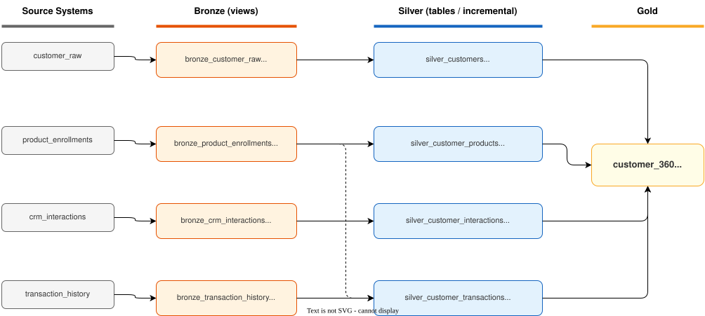

# Data Lineage

Visual diagram:



The diagram is color-coded by layer (grey = source, orange = bronze, blue = silver, yellow = gold) and shows materialization type and ingestion frequency on each node.

---

## 1. Source-to-Target Mapping

### Overview

| Source Table | Bronze Model | Silver Model | Gold Model |
|---|---|---|---|
| `customer_raw` | `bronze_customer_raw` | `silver_customers` | `customer_360` |
| `product_enrollments` | `bronze_product_enrollments` | `silver_customer_products` | `customer_360` |
| `crm_interactions` | `bronze_crm_interactions` | `silver_customer_interactions` | `customer_360` |
| `transaction_history` | `bronze_transaction_history` | `silver_customer_transactions` | `customer_360` |

> `silver_customer_transactions` is the exception — it LEFT JOINs `bronze_product_enrollments` on `product_id` to resolve product-type breakdowns (credit card vs savings). All other silver models have exactly one bronze source.

---

### Bronze Layer

Bronze models are thin `SELECT *` views over raw Delta source tables. No transformations are applied; `_ingested_at` is injected at ingestion time by `ingest_bronze.py`.

#### `bronze_customer_raw` ← `customer_raw`

| Target Column | Target Type | PK/FK | Source Table | Source Column | Source Type | Transformation | Notes |
|---|---|---|---|---|---|---|---|
| customer_id | STRING | PK | customer_raw | customer_id | STRING | Direct | Unique; not null |
| first_name | STRING | — | customer_raw | first_name | STRING | Direct | Not null |
| last_name | STRING | — | customer_raw | last_name | STRING | Direct | Not null |
| email | STRING | — | customer_raw | email | STRING | Direct | Not null |
| mobile | STRING | — | customer_raw | mobile | STRING | Direct | Raw format; normalised to digits-only in gold |
| gender | STRING | — | customer_raw | gender | STRING | Direct | `'Male'` / `'Female'` |
| date_of_birth | STRING | — | customer_raw | date_of_birth | STRING | Direct | Cast to DATE in gold |
| signup_date | STRING | — | customer_raw | signup_date | STRING | Direct | Cast to DATE in gold |
| _ingested_at | TIMESTAMP | — | system | — | — | Injected at ingestion | Watermark sentinel for incremental models |

#### `bronze_product_enrollments` ← `product_enrollments`

| Target Column | Target Type | PK/FK | Source Table | Source Column | Source Type | Transformation | Notes |
|---|---|---|---|---|---|---|---|
| product_id | STRING | PK | product_enrollments | product_id | STRING | Direct | Unique; not null |
| customer_id | STRING | FK → bronze_customer_raw | product_enrollments | customer_id | STRING | Direct | Not null |
| product_type | STRING | — | product_enrollments | product_type | STRING | Direct | `'Savings'` / `'Credit Card'`; UPPER normalised in gold |
| enrollment_date | STRING | — | product_enrollments | enrollment_date | STRING | Direct | Cast to DATE in gold |
| limit | DECIMAL(18,2) | — | product_enrollments | limit | DECIMAL(18,2) | Direct | Credit card limit; NULL for savings rows |
| _ingested_at | TIMESTAMP | — | system | — | — | Injected at ingestion | Watermark sentinel |

#### `bronze_crm_interactions` ← `crm_interactions`

| Target Column | Target Type | PK/FK | Source Table | Source Column | Source Type | Transformation | Notes |
|---|---|---|---|---|---|---|---|
| interaction_id | STRING | PK | crm_interactions | interaction_id | STRING | Direct | Unique; not null |
| customer_id | STRING | FK → bronze_customer_raw | crm_interactions | customer_id | STRING | Direct | Not null |
| interaction_type | STRING | — | crm_interactions | interaction_type | STRING | Direct | `'Email'` / `'Chat'` / `'Call'`; UPPER normalised in gold |
| interaction_date | STRING | — | crm_interactions | interaction_date | STRING | Direct | Cast to DATE in gold |
| _ingested_at | TIMESTAMP | — | system | — | — | Injected at ingestion | Watermark sentinel |

#### `bronze_transaction_history` ← `transaction_history`

| Target Column | Target Type | PK/FK | Source Table | Source Column | Source Type | Transformation | Notes |
|---|---|---|---|---|---|---|---|
| transaction_id | STRING | PK | transaction_history | transaction_id | STRING | Direct | Unique; not null |
| customer_id | STRING | FK → bronze_customer_raw | transaction_history | customer_id | STRING | Direct | Not null |
| product_id | STRING | FK → bronze_product_enrollments | transaction_history | product_id | STRING | Direct | Not null; used in gold JOIN for product-type breakdown |
| transaction_amount | DECIMAL(18,2) | — | transaction_history | transaction_amount | DECIMAL(18,2) | Direct | Positive = credit; negative = debit |
| closing_balance | DECIMAL(18,2) | — | transaction_history | closing_balance | DECIMAL(18,2) | Direct | Can be negative (overdraft) |
| transaction_date | STRING | — | transaction_history | transaction_date | STRING | Direct | Timezone-naive; cast to DATE in gold |
| _ingested_at | TIMESTAMP | — | system | — | — | Injected at ingestion | Watermark sentinel |

---

### Gold Layer — `customer_360`

Grain: 1 row per customer. Full refresh every hourly run. Source columns trace back to the four bronze tables; silver models handle intermediate aggregation.

#### From `bronze_customer_raw`

| Target Column | Target Type | PK/FK | Source Table | Source Column | Source Type | Transformation | Notes |
|---|---|---|---|---|---|---|---|
| customer_id | STRING | PK | bronze_customer_raw | customer_id | STRING | Direct; dedup keeps latest _ingested_at | Unique; not null |
| first_name | STRING | — | bronze_customer_raw | first_name | STRING | `TRIM()` | Not null |
| last_name | STRING | — | bronze_customer_raw | last_name | STRING | `TRIM()` | Not null |
| full_name | STRING | — | bronze_customer_raw | first_name, last_name | STRING | `CONCAT(TRIM(first_name), ' ', TRIM(last_name))` | Derived; not null |
| email | STRING | — | bronze_customer_raw | email | STRING | `LOWER(TRIM())` | Not null |
| mobile_clean | STRING | — | bronze_customer_raw | mobile | STRING | `NULLIF(REGEXP_REPLACE(CAST(mobile AS STRING), '[^0-9]', ''), '')` | Digits only; NULL if raw value has no digits |
| gender | STRING | — | bronze_customer_raw | gender | STRING | `TRIM()` | Not null |
| date_of_birth | DATE | — | bronze_customer_raw | date_of_birth | STRING | `CAST(AS DATE)` | Not null |
| signup_date | DATE | — | bronze_customer_raw | signup_date | STRING | `CAST(AS DATE)` | Not null |
| age | INT | — | bronze_customer_raw | date_of_birth | STRING | `FLOOR(MONTHS_BETWEEN(CURRENT_DATE(), CAST(date_of_birth AS DATE)) / 12)` | Recalculated on every refresh |
| age_band | STRING | — | bronze_customer_raw | date_of_birth | STRING | `CASE: 'Under 18' / '18-24' / '25-34' / '35-44' / '45-54' / '55-64' / '65+'` | 7 buckets derived from age |
| days_since_signup | INT | — | bronze_customer_raw | signup_date | STRING | `DATEDIFF(CURRENT_DATE(), CAST(signup_date AS DATE))` | Recalculated on every refresh |

#### From `bronze_product_enrollments`

| Target Column | Target Type | PK/FK | Source Table | Source Column | Source Type | Transformation | Notes |
|---|---|---|---|---|---|---|---|
| total_products | INT | — | bronze_product_enrollments | product_id | STRING | `COUNT(*) per customer_id` | COALESCE to 0; includes re-opened accounts |
| credit_card_count | INT | — | bronze_product_enrollments | product_type | STRING | `SUM(CASE WHEN UPPER(TRIM(product_type)) = 'CREDIT CARD' THEN 1 ELSE 0 END)` | COALESCE to 0 |
| savings_count | INT | — | bronze_product_enrollments | product_type | STRING | `SUM(CASE WHEN UPPER(TRIM(product_type)) = 'SAVINGS' THEN 1 ELSE 0 END)` | COALESCE to 0 |
| max_credit_limit | DECIMAL(18,2) | — | bronze_product_enrollments | limit | DECIMAL(18,2) | `MAX(limit) WHERE product_type = 'CREDIT CARD'` | NULL for savings-only; not 0 — distinguishes no card from zero-limit card |
| total_credit_limit | DECIMAL(18,2) | — | bronze_product_enrollments | limit | DECIMAL(18,2) | `SUM(COALESCE(limit, 0)) per customer_id` | 0 for savings-only |
| first_product_date | DATE | — | bronze_product_enrollments | enrollment_date | STRING | `MIN(CAST(enrollment_date AS DATE))` | NULL for no-product customers |
| latest_product_date | DATE | — | bronze_product_enrollments | enrollment_date | STRING | `MAX(CAST(enrollment_date AS DATE))` | NULL for no-product customers |
| has_credit_card | BOOLEAN | — | bronze_product_enrollments | product_type | STRING | `COUNT WHERE product_type = 'CREDIT CARD' > 0` | COALESCE to false |
| has_savings | BOOLEAN | — | bronze_product_enrollments | product_type | STRING | `COUNT WHERE product_type = 'SAVINGS' > 0` | COALESCE to false |
| is_multi_product | BOOLEAN | — | bronze_product_enrollments | product_id | STRING | `COUNT(*) >= 2` | COALESCE to false |
| product_segment | STRING | — | bronze_product_enrollments | product_type | STRING | `CASE: 'Savings + Credit Card' / 'Credit Card Only' / 'Savings Only' / 'No Product'` | COALESCE to `'No Product'`; 4 values |

#### From `bronze_crm_interactions`

| Target Column | Target Type | PK/FK | Source Table | Source Column | Source Type | Transformation | Notes |
|---|---|---|---|---|---|---|---|
| total_interactions | INT | — | bronze_crm_interactions | interaction_id | STRING | `COUNT(*) per customer_id` | COALESCE to 0 |
| email_interactions | INT | — | bronze_crm_interactions | interaction_type | STRING | `SUM(CASE WHEN UPPER(TRIM(interaction_type)) = 'EMAIL' THEN 1 ELSE 0 END)` | COALESCE to 0 |
| chat_interactions | INT | — | bronze_crm_interactions | interaction_type | STRING | `SUM(CASE WHEN UPPER(TRIM(interaction_type)) = 'CHAT' THEN 1 ELSE 0 END)` | COALESCE to 0 |
| call_interactions | INT | — | bronze_crm_interactions | interaction_type | STRING | `SUM(CASE WHEN UPPER(TRIM(interaction_type)) = 'CALL' THEN 1 ELSE 0 END)` | COALESCE to 0 |
| first_interaction_date | DATE | — | bronze_crm_interactions | interaction_date | STRING | `MIN(CAST(interaction_date AS DATE))` | NULL for no-interaction customers |
| last_interaction_date | DATE | — | bronze_crm_interactions | interaction_date | STRING | `MAX(CAST(interaction_date AS DATE))` | NULL for no-interaction customers |
| last_interaction_type | STRING | — | bronze_crm_interactions | interaction_type, interaction_date | STRING | `MAX_BY(UPPER(TRIM(interaction_type)), interaction_date)` | NULL for no-interaction customers; arbitrary if tie on same date |

#### From `bronze_transaction_history` (+ `bronze_product_enrollments` LEFT JOIN on `product_id`)

| Target Column | Target Type | PK/FK | Source Table | Source Column | Source Type | Transformation | Notes |
|---|---|---|---|---|---|---|---|
| total_transactions | INT | — | bronze_transaction_history | transaction_id | STRING | `COUNT(*) per customer_id` | COALESCE to 0 |
| debit_count | INT | — | bronze_transaction_history | transaction_amount | DECIMAL(18,2) | `COUNT WHERE transaction_amount < 0` | COALESCE to 0 |
| credit_count | INT | — | bronze_transaction_history | transaction_amount | DECIMAL(18,2) | `COUNT WHERE transaction_amount > 0` | COALESCE to 0 |
| total_transaction_value | DECIMAL(18,2) | — | bronze_transaction_history | transaction_amount | DECIMAL(18,2) | `SUM(ABS(transaction_amount))` | Always >= 0; activity volume not net position; COALESCE to 0 |
| net_transaction_amount | DECIMAL(18,2) | — | bronze_transaction_history | transaction_amount | DECIMAL(18,2) | `SUM(transaction_amount)` | Signed; positive = net inflow; COALESCE to 0 |
| avg_transaction_value | DECIMAL(18,2) | — | bronze_transaction_history | transaction_amount | DECIMAL(18,2) | `AVG(ABS(transaction_amount))` | Always >= 0; COALESCE to 0 |
| total_debit_value | DECIMAL(18,2) | — | bronze_transaction_history | transaction_amount | DECIMAL(18,2) | `SUM(ABS(transaction_amount)) WHERE transaction_amount < 0` | COALESCE to 0 |
| total_credit_value | DECIMAL(18,2) | — | bronze_transaction_history | transaction_amount | DECIMAL(18,2) | `SUM(ABS(transaction_amount)) WHERE transaction_amount > 0` | COALESCE to 0 |
| max_balance | DECIMAL(18,2) | — | bronze_transaction_history | closing_balance | DECIMAL(18,2) | `MAX(closing_balance)` | NULL for no-transaction customers; can be negative (overdraft) |
| min_balance | DECIMAL(18,2) | — | bronze_transaction_history | closing_balance | DECIMAL(18,2) | `MIN(closing_balance)` | NULL for no-transaction customers |
| current_balance | DECIMAL(18,2) | — | bronze_transaction_history | closing_balance, transaction_date | DECIMAL(18,2), STRING | `MAX_BY(closing_balance, transaction_date)` | Balance at most recent transaction; NULL for no-transaction customers |
| first_transaction_date | DATE | — | bronze_transaction_history | transaction_date | STRING | `MIN(CAST(transaction_date AS DATE))` | NULL for no-transaction customers |
| last_transaction_date | DATE | — | bronze_transaction_history | transaction_date | STRING | `MAX(CAST(transaction_date AS DATE))` | NULL for no-transaction customers |
| credit_card_transaction_value | DECIMAL(18,2) | — | bronze_transaction_history + bronze_product_enrollments | transaction_amount, product_type | DECIMAL, STRING | `SUM(ABS(transaction_amount)) WHERE product_type = 'CREDIT CARD'` | JOIN on product_id; COALESCE to 0 |
| savings_transaction_value | DECIMAL(18,2) | — | bronze_transaction_history + bronze_product_enrollments | transaction_amount, product_type | DECIMAL, STRING | `SUM(ABS(transaction_amount)) WHERE product_type = 'SAVINGS'` | COALESCE to 0 |
| credit_card_net_transaction_amount | DECIMAL(18,2) | — | bronze_transaction_history + bronze_product_enrollments | transaction_amount, product_type | DECIMAL, STRING | `SUM(transaction_amount) WHERE product_type = 'CREDIT CARD'` | Signed; COALESCE to 0 |
| savings_net_transaction_amount | DECIMAL(18,2) | — | bronze_transaction_history + bronze_product_enrollments | transaction_amount, product_type | DECIMAL, STRING | `SUM(transaction_amount) WHERE product_type = 'SAVINGS'` | Signed; COALESCE to 0 |
| credit_card_transaction_count | INT | — | bronze_transaction_history + bronze_product_enrollments | product_type | STRING | `COUNT WHERE product_type = 'CREDIT CARD'` | COALESCE to 0 |
| savings_transaction_count | INT | — | bronze_transaction_history + bronze_product_enrollments | product_type | STRING | `COUNT WHERE product_type = 'SAVINGS'` | COALESCE to 0 |

#### Derived in `customer_360`

Computed fresh on every hourly run from the joined data above.

| Target Column | Target Type | PK/FK | Source Column(s) | Source Type | Transformation | Notes / Business Rule |
|---|---|---|---|---|---|---|
| last_activity_date | DATE | — | last_transaction_date, last_interaction_date | DATE | `GREATEST()` with NULL-safe CASE | NULL if no transactions and no interactions |
| days_since_last_transaction | INT | — | last_transaction_date | DATE | `DATEDIFF(CURRENT_DATE(), last_transaction_date)` | NULL if no transactions |
| days_since_last_interaction | INT | — | last_interaction_date | DATE | `DATEDIFF(CURRENT_DATE(), last_interaction_date)` | NULL if no interactions |
| days_since_last_activity | INT | — | last_activity_date | DATE | `DATEDIFF(CURRENT_DATE(), last_activity_date)` | NULL if never active |
| is_active_customer | BOOLEAN | — | last_activity_date, days_since_last_activity | DATE, INT | `last_activity_date IS NOT NULL AND days_since_last_activity <= 90` | TRUE only when customer_status = 'Active' |
| customer_status | STRING | — | last_activity_date, days_since_last_activity | DATE, INT | `CASE: 'Never Active' (NULL) / 'Active' (≤90d) / 'At Risk' (≤180d) / 'Dormant' (>180d)` | Thresholds: `active_days_threshold=90`, `at_risk_days_threshold=180` (dbt vars) |
| customer_value_segment | STRING | — | total_transaction_value | DECIMAL(18,2) | `CASE: 'High Value' (≥150k) / 'Medium Value' (≥50k) / 'Low Value' (>0) / 'No Transaction'` | Thresholds: `high_value_transaction_threshold=150000`, `medium_value_transaction_threshold=50000` |
| customer_segment | STRING | — | has_credit_card, total_transaction_value, is_multi_product | BOOLEAN, DECIMAL, BOOLEAN | `CASE: 'Premium' (has_credit_card AND ≥100k) / 'Standard' (is_multi_product) / 'Basic'` | Evaluated top-down; `premium_transaction_threshold=100000` |
| engagement_segment | STRING | — | total_interactions | INT | `CASE: 'Highly Engaged' (≥10) / 'Moderately Engaged' (≥3) / 'Low Engagement' (>0) / 'No CRM Engagement'` | Thresholds: `highly_engaged_interaction_threshold=10`, `moderately_engaged_interaction_threshold=3` |
| credit_card_activity_to_limit_ratio | DECIMAL | — | credit_card_transaction_value, max_credit_limit | DECIMAL | `credit_card_transaction_value / max_credit_limit` | NULL when max_credit_limit is 0 or NULL; lifetime activity volume, not true credit utilisation |
| customer_lifecycle_stage | STRING | — | days_since_signup | INT | `CASE: 'New' (<90d) / 'Growing' (<365d) / 'Established' (<1095d) / 'Mature'` | Thresholds configurable via dbt vars; advances automatically on each refresh |

#### Watermark columns

| Target Column | Target Type | Source Table | Source Column | Transformation | Notes |
|---|---|---|---|---|---|
| _customer_ingested_at | TIMESTAMP | bronze_customer_raw | _ingested_at | `COALESCE(c._ingested_at, '1970-01-01')` | Epoch fallback when LEFT JOIN finds no match |
| _products_ingested_at | TIMESTAMP | bronze_product_enrollments | _ingested_at | `COALESCE(p._ingested_at, '1970-01-01')` | |
| _interactions_ingested_at | TIMESTAMP | bronze_crm_interactions | _ingested_at | `COALESCE(i._ingested_at, '1970-01-01')` | |
| _transactions_ingested_at | TIMESTAMP | bronze_transaction_history | _ingested_at | `COALESCE(t._ingested_at, '1970-01-01')` | |
| _latest_source_ingested_at | TIMESTAMP | (derived) | all four _ingested_at | `GREATEST(_customer_ingested_at, _products_ingested_at, _interactions_ingested_at, _transactions_ingested_at)` | Most recent ingestion across all source streams |
| _gold_updated_at | TIMESTAMP | system | — | `CURRENT_TIMESTAMP()` | Rebuild timestamp; refreshed on every hourly run |

---

## 2. Transformation Flow Per Layer

### Source → Bronze
- No transformation. Bronze models are thin `SELECT *` views over raw Delta tables.
- Adds `_ingested_at` (load timestamp) as a freshness and watermark sentinel.
- Purpose: decouple downstream models from raw table names; if a source table is renamed, only the bronze model changes.

### Bronze → Silver
| Model | Transformation |
|-------|---------------|
| `silver_customers` | TRIM names, LOWER email, NULLIF(REGEXP_REPLACE) mobile to digits-only, derive `age`, `age_band`, `days_since_signup`, `full_name`; deduplicate on `customer_id` keeping latest `_ingested_at` |
| `silver_customer_products` | GROUP BY customer_id — COUNT(*) total and per type (CREDIT CARD / SAVINGS), MAX(limit) and SUM(limit) for credit cards, MIN/MAX(enrollment_date); derive `has_credit_card`, `has_savings`, `is_multi_product` flags and `product_segment` |
| `silver_customer_interactions` | GROUP BY customer_id — COUNT by type (EMAIL, CHAT, CALL), MIN/MAX(interaction_date), MAX_BY for last channel; Liquid Clustered on `customer_id` |
| `silver_customer_transactions` | GROUP BY customer_id from `bronze_transaction_history` LEFT JOIN `bronze_product_enrollments` — SUM(ABS), SUM, COUNT, AVG, MAX, MIN, MAX_BY; product-type breakdowns (credit card / savings) resolved via `product_id` FK; Liquid Clustered on `customer_id` |

### Silver → Gold
- `customer_360` LEFT JOINs all four silver models on `customer_id`. Full refresh on every hourly run.
- COALESCE nulls (customers with no products / interactions / transactions) to 0.
- Derives all time-relative and business metrics fresh on every run:

| Derived Field | Logic |
|---|---|
| `days_since_last_transaction`, `days_since_last_interaction`, `days_since_last_activity` | `DATEDIFF(CURRENT_DATE(), ...)` — always current |
| `customer_status` | `'Never Active'` / `'Active'` (≤90d) / `'At Risk'` (≤180d) / `'Dormant'` (>180d) |
| `is_active_customer` | TRUE when `customer_status = 'Active'` |
| `customer_segment` | `'Premium'` / `'Standard'` / `'Basic'` — credit card + transaction threshold |
| `customer_value_segment` | `'High Value'` / `'Medium Value'` / `'Low Value'` / `'No Transaction'` |
| `engagement_segment` | `'Highly Engaged'` / `'Moderately Engaged'` / `'Low Engagement'` / `'No CRM Engagement'` |
| `customer_lifecycle_stage` | `'New'` / `'Growing'` / `'Established'` / `'Mature'` — from `days_since_signup` |
| `credit_card_activity_to_limit_ratio` | `credit_card_transaction_value / max_credit_limit` |
| `age`, `days_since_signup` | Recalculated on every refresh from `CURRENT_DATE()` |

Full business logic for each derived field: [`business_metrics.md`](business_metrics.md)

---

## 3. Model Dependencies

```
bronze_customer_raw
    └── silver_customers
            └── customer_360

bronze_product_enrollments
    ├── silver_customer_products
    │       └── customer_360
    └── silver_customer_transactions (LEFT JOIN on product_id)
            └── customer_360

bronze_crm_interactions
    └── silver_customer_interactions
            └── customer_360

bronze_transaction_history
    └── silver_customer_transactions
            └── customer_360
```

dbt `ref()` calls make these dependencies explicit and enforce execution order. Run `dbt ls --select customer_360+` to see the full DAG.

---

## 4. Incremental Watermarks

Incremental models filter on `_ingested_at` (not the business timestamp) to avoid reprocessing issues from late-arriving records or timezone-ambiguous event times.

| Model | Watermark Column | Strategy | Clustering |
|-------|-----------------|----------|------------|
| `silver_customer_interactions` | `_ingested_at` | merge on `customer_id` | Liquid Clustered on `customer_id` |
| `silver_customer_transactions` | `_ingested_at` | merge on `customer_id` | Liquid Clustered on `customer_id` |

`customer_360` (gold) is a full-refresh `table` — it joins all four silver sources on every run. No Liquid Clustering (full refresh rewrites all files each hour; clustering cannot persist between runs at current scale). Watermark-based incremental logic at the gold layer is not used — time-relative derived metrics must be recalculated for every customer on every run regardless of activity. See [`design_decisions.md`](design_decisions.md) §2 for the full comparison.
