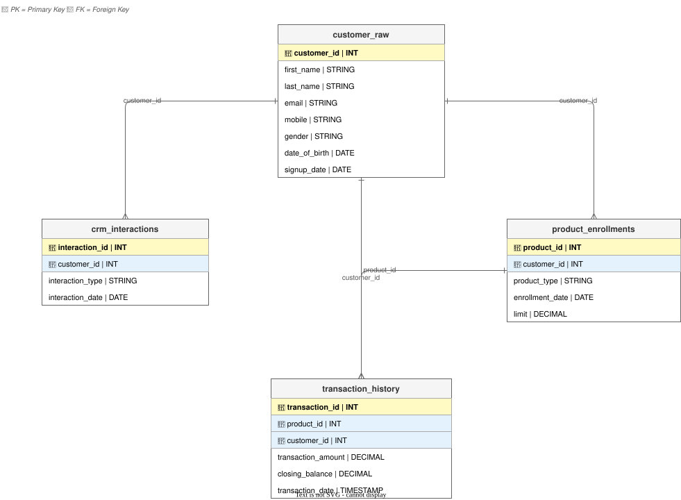

# Data Model Design

## 1. Entity Relationship Diagram (Source Layer)

Diagram:

The ERD covers all four source tables with column names, data types, PK/FK markers (🔑/🔗), and crow's foot cardinality lines (1:N).

Source table schemas and sample data: [`schema.md`](../schema.md)

**Cardinalities:**
- `customer_raw` (1) → `product_enrollments` (N) on `customer_id`
- `customer_raw` (1) → `crm_interactions` (N) on `customer_id`
- `customer_raw` (1) → `transaction_history` (N) on `customer_id`
- `product_enrollments` (1) → `transaction_history` (N) on `product_id`

---

## 2. Table Schemas

### Source Tables
Full column definitions and sample data: [`schema.md`](../schema.md)

| Table | Rows (approx.) | PK | Description |
|-------|----------------|----|-------------|
| `customer_raw` | 100,000 | `customer_id` | Customer demographics and signup |
| `product_enrollments` | 140,000 | `product_id` | Product enrollment records per customer |
| `crm_interactions` | 243,000 | `interaction_id` | CRM interaction history |
| `transaction_history` | 887,000 | `transaction_id` | Financial transactions per product |

### dbt Model Columns

Column-level test definitions for each layer live in the corresponding `schema.yml`:

| Layer | File |
|-------|------|
| Bronze | [`models/bronze/schema.yml`](../customer_360/models/bronze/schema.yml) |
| Silver | [`models/silver/schema.yml`](../customer_360/models/silver/schema.yml) |
| Gold | [`models/gold/schema.yml`](../customer_360/models/gold/schema.yml) |

**Bronze** — thin views over raw tables; all source columns pass through unchanged, plus `_ingested_at` (load timestamp).

**Silver** — one row per customer per model; adds cleaned/derived fields:

| Model | Key Columns Added |
|-------|-------------------|
| `silver_customers` | `mobile_clean`, `age`, `days_since_signup` |
| `silver_customer_products` | `total_products`, `credit_card_count`, `savings_count`, `max_credit_limit`, `first_product_date` |
| `silver_customer_interactions` | `total_interactions`, `email_interactions`, `chat_interactions`, `last_interaction_date`, `days_since_last_interaction` |
| `silver_customer_transactions` | `total_transactions`, `total_transaction_value`, `avg_transaction_amount`, `max_balance`, `min_balance`, `last_transaction_date`, `days_since_last_transaction`, `credit_card_transaction_value`, `savings_transaction_value`, `credit_card_transaction_count`, `savings_transaction_count` |

**Gold** — joins all four silver models into `customer_360`; adds:

| Column | Description |
|--------|-------------|
| `customer_status` | `Active` / `Inactive` — based on 90-day activity window |
| `customer_segment` | `Premium` / `Standard` / `Basic` — based on product count and transaction value |

---

## 3. Grain and Cardinality

| Layer | Model | Grain | Row Count (approx.) |
|-------|-------|-------|---------------------|
| Bronze | `bronze_customer_raw` | 1 row per customer | = source (100k) |
| Bronze | `bronze_product_enrollments` | 1 row per product enrollment | = source (140k) |
| Bronze | `bronze_crm_interactions` | 1 row per CRM interaction | = source (243k) |
| Bronze | `bronze_transaction_history` | 1 row per financial transaction | = source (887k) |
| Silver | `silver_customers` | 1 row per customer | = bronze_customer_raw (100k) |
| Silver | `silver_customer_products` | 1 row per customer (aggregated) | ≤ 100k |
| Silver | `silver_customer_interactions` | 1 row per customer (aggregated) | ≤ 100k |
| Silver | `silver_customer_transactions` | 1 row per customer (aggregated) | ≤ 100k |
| Gold | `customer_360` | 1 row per customer | = silver_customers (100k) |

The gold layer uses `LEFT JOIN` across all silver models so every customer in `silver_customers` appears in `customer_360`, even if they have no products, interactions, or transactions.
