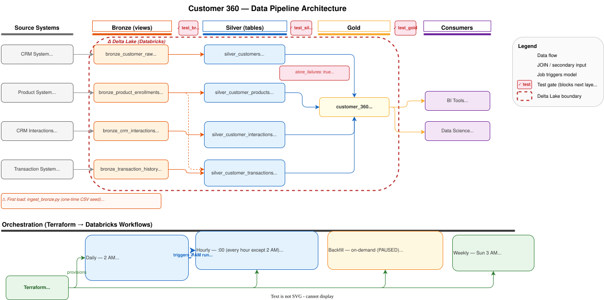

# Design Decisions

Architecture diagram:



The diagram covers the full pipeline: source systems → ingestion → Bronze/Silver/Gold (Delta Lake) → consumers, plus the orchestration layer (four Databricks Workflow jobs provisioned by Terraform) and where dbt tests fire.

---

## 1. Medallion Architecture (Bronze → Silver → Gold)

**Decision**: Three-layer medallion — Bronze (raw views) → Silver (clean, aggregated, one row per customer) → Gold (joined, business-logic enriched).

**Rationale**:
- Bronze views create a stable contract between raw source tables and downstream models. If a source table is renamed, only the bronze model changes.
- Silver isolates cleaning and aggregation logic; each silver model has a single responsibility (demographics, products, interactions, transactions).
- Gold is purely a join + business logic layer — no aggregation happens there.

**Trade-off**: An extra layer adds query hops. Accepted because concern isolation outweighs the marginal performance cost, especially with Delta caching on Databricks.

---

## 2. Materialization Strategy

Full configuration: [`customer_360/dbt_project.yml`](../customer_360/dbt_project.yml)

| Model | Materialization | Rationale |
|-------|----------------|-----------|
| Bronze (all) | `view` | No storage cost; always reflects latest raw data |
| `silver_customers` | `table` (full refresh) | Source is small (100k rows); demographics change slowly; simpler than incremental |
| `silver_customer_products` | `table` (full refresh) | Same reasoning; enrollment data is relatively stable |
| `silver_customer_interactions` | `incremental` (merge) | High-volume source (243k+); append-heavy; watermark-based processing avoids full scans |
| `silver_customer_transactions` | `incremental` (merge) | Highest-volume source (887k+); same reasoning |
| `customer_360` | `incremental` (merge) | Inherits from silver incrementals; avoids reprocessing 100k customer rows per run |

**Incremental watermark**: `_ingested_at` (load timestamp) is used rather than the business event timestamp (`transaction_date`, `interaction_date`). This avoids reprocessing failures caused by late-arriving records or timezone-ambiguous event times.

**Gold watermarks**: `customer_360` carries two independent watermarks (`_interactions_ingested_at`, `_transactions_ingested_at`) to prevent cross-contamination — a new transaction batch should not trigger reprocessing of all customers just because the interaction watermark hasn't advanced.

---

## 3. Refresh Frequency — Hourly vs Daily

**Decision**: Silver and gold models are split across two schedules — daily full-refresh at 2 AM for dimension tables, hourly incremental for event-driven tables and gold.

| Model | Frequency | Reason |
|---|---|---|
| `silver_customers` | Daily 2 AM | Demographics (name, DOB, email) change rarely — daily is sufficient. Full refresh on 100k rows is cheap. |
| `silver_customer_products` | Daily 2 AM | Product enrollments are relatively stable events. New enrollments don't affect same-day activity metrics. |
| `silver_customer_interactions` | Hourly | CRM interactions arrive continuously. `days_since_last_interaction` is used in `customer_status` — a stale value could misclassify an Active customer as Inactive within the same day. |
| `silver_customer_transactions` | Hourly | Highest-volume source (887k+). Transactions are the primary signal for `customer_status` and `customer_segment` — freshness directly affects business decisions. |
| `customer_360` | Hourly | Inherits from the hourly incrementals. Refreshing gold less frequently than its silver inputs would mean BI consumers see stale status/segment values even after silver has updated. |

**Scheduling dependency**: The daily job runs at 2 AM. The hourly job also fires at 2 AM. Because the hourly job depends on silver models that are rebuilt by the daily job, the daily job must complete before the 2 AM hourly run picks up fresh dimension data. In practice, the daily full-refresh is fast (100k rows) and completes well within the hour window — but this is an implicit dependency, not an enforced one. If the daily job ever runs long, the 2 AM hourly run will use the previous day's dimension data.

**Trade-off**: Running `silver_customers` and `silver_customer_products` hourly would eliminate the implicit dependency but adds unnecessary compute — demographics and product enrollments don't change at hourly granularity.

See [`databricks-workflows/`](../terraform/databricks-workflows/) for the Terraform schedule configuration.

---

## 4. Clustering Strategy

Full analysis: [`docs/clustering_comparison.md`](clustering_comparison.md)

**Decision**: Liquid Clustering on `customer_id` for the gold table (Databricks Runtime 13.3+).

**Rationale**: BI tools (Power BI, Tableau) filter and join on `customer_id`. Liquid Clustering automatically co-locates files by `customer_id` without requiring a manual OPTIMIZE job or upfront knowledge of the data distribution.

**Trade-off vs Z-Ordering**: Z-Ordering requires explicit `OPTIMIZE ZORDER BY` runs and degrades over time as new data arrives. Liquid Clustering is self-maintaining. See `clustering_comparison.md` for the full comparison.

---

## 5. `store_failures: true` Globally

**Decision**: All dbt tests run with `store_failures: true` (set in `dbt_project.yml`).

**Rationale**: Failed test rows are written to a dedicated audit table in Databricks (e.g. `dbt_test__audit.not_null_silver_customers_email`). This makes DQ failures inspectable and queryable without re-running the pipeline. Particularly important for the `unique` test on `silver_customers.email` — duplicate email pairs need investigation, not silent failure.

Test definitions: [`models/bronze/schema.yml`](../customer_360/models/bronze/schema.yml), [`models/silver/schema.yml`](../customer_360/models/silver/schema.yml), [`models/gold/schema.yml`](../customer_360/models/gold/schema.yml)

---

## 6. Bronze Ingestion: Case Study vs Production


The current implementation treats bronze ingestion as a **one-time manual seed** (`databricks-scripts/ingest_bronze.py`) — CSV files are loaded once into Delta tables and that is the starting point for the dbt pipeline.

In production this is not the case. Each source table would need a continuous ingestion pattern appropriate to its source system:

| Source Table | Likely production pattern | Open questions |
|---|---|---|
| `customer_raw` | Batch (daily CRM export or CDC) | Is CDC enabled on the CRM database? |
| `product_enrollments` | Batch or event-driven | Does enrollment trigger an event or is it polled? |
| `crm_interactions` | Near real-time or streaming | Does the CRM expose a Kafka topic or REST API? |
| `transaction_history` | Streaming or micro-batch | Is the transaction system CDC-enabled? What is the SLA? |

The bronze models and `ingest_bronze.py` would need to be redesigned once source system details are confirmed. Until those details are known, **the ingestion layer should be treated as a placeholder**.

The dbt incremental models (`silver_customer_interactions`, `silver_customer_transactions`, `customer_360`) are already designed for continuous ingestion — they use `_ingested_at` watermarks and merge on `customer_id`. Only the bronze ingestion mechanism needs to change; the dbt layer is production-ready.

---

## 7. No Deduplication by Email

**Decision**: `silver_customers` does NOT deduplicate by email. `customer_id` is the true PK.

**Rationale**: 3 email addresses are shared across 6 distinct customers (different names, genders, dates of birth). These are real, separate people. Deduplicating by email would incorrectly merge valid customers and collapse their product holdings, transactions, and interaction histories. The `unique` test with `store_failures: true` flags duplicates for investigation without polluting the model with a flag column.

See [`data_quality.md`](data_quality.md) Issue 2.

---

## 8. `dbt build` over `dbt run` in Production Workflows

**Decision**: All Databricks workflow tasks use `dbt build` instead of `dbt run` + a separate `dbt test` task.

**Rationale**: `dbt build` runs the model and its tests in sequence, blocking downstream tasks on failure. With `dbt run` + `dbt test` as separate tasks, a test failure sends an alert but all models have already been built — bad data in `silver_customers` (the FK anchor for all other silver models) would propagate into `silver_customer_products` and `customer_360` before the failure is caught. In an hourly pipeline, that means up to an hour of a corrupted gold table serving BI consumers.

**Exception**: The custom business rule tests (`assert_*`) are singular tests — standalone DAG nodes with no model to build. They run as a final `dbt test --select test_type:singular` task after `customer_360` is built, not via `dbt build`.

**Trade-off**: `dbt build` is a harder failure mode — a flaky test will block the entire downstream refresh. Teams that prefer soft failures (build everything, alert but don't block) should use `dbt run` + `dbt test` explicitly. For this pipeline, data correctness takes priority over refresh availability.

See [`databricks-workflows/`](../terraform/databricks-workflows/) for the Terraform implementation.

---

## 9. Separate Backfill Pipeline

**Decision**: A dedicated backfill Databricks job exists alongside the hourly and daily production jobs. It is `PAUSED` by default and triggered manually (or via CI) — never on a schedule.

**When to trigger:**
- Bug fix in transformation logic that affects historical records
- Business rule change (e.g. segmentation thresholds updated)
- Source data correction upstream
- New column added to an incremental silver model
- Initial historical load on first deployment

**Why not Lambda architecture**: Lambda would maintain a separate batch layer running the same transformations on a slower cadence. That means two codepaths to maintain, two sets of results to reconcile, and two places for logic to diverge. The backfill job uses the exact same dbt models as production — there is no separate batch layer.

**Why not pure Kappa architecture**: Pure Kappa replays raw events through the same streaming pipeline for both real-time and historical reprocessing. This works cleanly for event-level models but breaks down here because silver models aggregate to customer grain (`GROUP BY customer_id`). Replaying only new events cannot correctly recompute aggregates for customers whose historical records are affected — a full recompute per customer is always required. Storing pre-aggregation raw events in silver to enable true event replay would add complexity without benefit given the current grain.

**Mechanism**: The backfill job accepts two parameters at trigger time — `backfill_start` (inclusive) and `backfill_end` (exclusive).

| Parameters provided | Behaviour |
|---|---|
| `backfill_start` + `backfill_end` | Windowed backfill — identifies affected `customer_id`s from the window, recomputes full history for those customers, merges. Unaffected customers untouched. |
| Neither | Full refresh — drops and rebuilds the entire table from scratch. Nuclear option for schema changes or initial loads. |

```sql
-- Pattern in silver incremental models

    AND customer_id IN (
        SELECT DISTINCT customer_id FROM {{ ref('bronze_...') }}
        WHERE _ingested_at >= '{{ var("backfill_start") }}'
          AND _ingested_at <  '{{ var("backfill_end") }}'
    )

    AND _ingested_at > (SELECT MAX(_ingested_at) FROM {{ this }})

-- No branch = full refresh (dbt handles via --full-refresh flag)
```

`silver_customers` and `silver_customer_products` are excluded — they are full-refresh tables rebuilt by the daily job and do not need backfill.

**Why trace to exact date rather than always full-refresh**: Full refresh reprocesses 887k+ transactions regardless of how many records were actually affected. In production, a bug is typically traced to a specific ingestion batch — backfilling only that window is faster, leaves unaffected customers untouched, and reduces the blast radius if the backfill itself has an issue.

See [`workflow_backfill.tf`](../terraform/databricks-workflows/workflow_backfill.tf) for the Terraform implementation.
